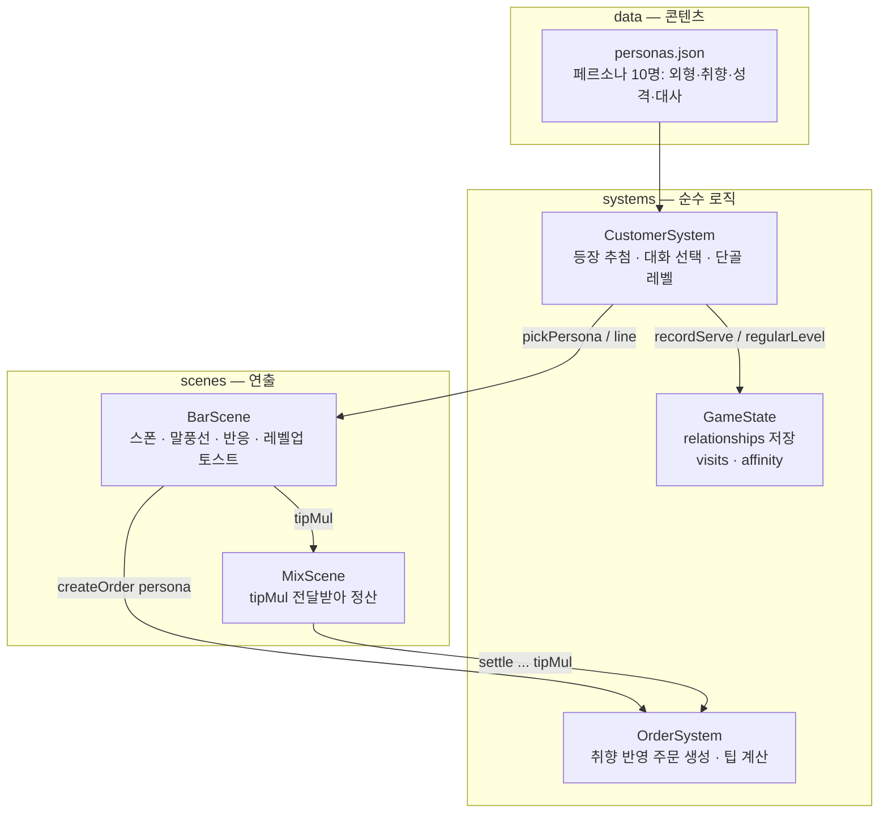

# 손님 시스템 구조 설계 — 페르소나 · 대화 · 단골

## 설계 목표

1. **데이터 주도 확장**: 손님 추가 = `personas.json`에 항목 추가. 코드 수정 없음
2. **엔진 비의존**: 규칙(등장 확률·대화 선택·호감도)은 `systems/CustomerSystem.ts` 순수 TS — 씬은 연출만
3. **저장 호환**: 단골 호감도는 기존 세이브 스키마에 optional 필드로 추가 (구버전 세이브 그대로 로드됨)

## 구조도

## 1. 페르소나 (`src/data/personas.json`)

초기 10명. 각 항목:

| 필드 | 역할 |
|---|---|
| `look` | 정면 스프라이트 생성 파라미터 (body/hair/skin/glasses) — 페르소나별 고정 외형이라 알아볼 수 있음 |
| `favorites` / `dislikes` | 주문 확률 가중 4배 / 절대 주문 안 함 |
| `patienceMul` | 기본 인내심 75초에 곱함 (박사장 0.75 ~ 은자씨 1.5) |
| `tipMul` | 팁 배율 (유리 0.8 ~ 박사장 1.5) |
| `visitWeight` | 등장 확률 가중치 |
| `dialogue` | 상황 키 8종별 대사 풀 (아래) |

**초기 로스터**: 김과장(회사원) · 유리(대학생) · 마르코(여행객) · 서연(디자이너) · 박사장(옆가게 사장) · 하늘(소설가) · 민준(트레이너) · 지은(간호사) · 톰(영어강사) · 은자씨(어르신) — 취향이 15종 레시피와 티어를 고르게 커버하도록 배치.

**확장 방법**: JSON에 항목 추가만으로 끝. `favorites`가 새 레시피를 참조하면 그 레시피의 수요가 생긴다. (대사 8키 필수 — 빠지면 `line()`이 '…' 폴백)

## 2. 대화 시스템

상황 키 → 대사 풀에서 랜덤 선택 + 변수 치환(`{drink}`, `{desired}`):

| 키 | 시점 |
|---|---|
| `greet` | 착석 직후 (1.7초 뒤 주문 대사로 전환) |
| `order` / `orderFallback` | 주문 (메뉴에 있음 / 없어서 대체) |
| `serveGood` / `serveOk` / `serveBad` | 서빙 반응 (점수 ≥0.7 / ≥0.4 / 미만) |
| `angry` | 인내심 소진으로 떠날 때 (1.4초 노출 후 퇴장) |
| `regular` | 단골(레벨 2+)의 greet 60% 확률 대체 |

연출 시퀀스(BarScene): `입장 → 착석 → greet → order → (조주) → 반응대사+애니메이션 → 퇴장`

## 3. 단골 시스템

### 호감도 (affinity) — 세이브 저장
- 서빙 점수 ≥0.85 → **+2**, ≥0.6 → +1, ≥0.35 → 0, 미만 → −1
- 화나서 떠남 → **−2** (0 밑으로는 안 내려감)

### 레벨 (CustomerSystem.REGULAR_LEVELS — 상수 테이블로 튜닝)

| 레벨 | 호칭 | 필요 호감도 | 인내심 | 팁 | 방문 빈도 |
|---|---|---|---|---|---|
| 0 | 뜨내기 | 0 | — | — | ×1.0 |
| 1 | 아는 손님 | 4 | +10% | +10% | ×1.3 |
| 2 | 단골 | 10 | +20% | +25% | ×1.6 |
| 3 | VIP | 20 | +30% | +50% | ×2.0 |

### 표시
- 이름 옆 하트(♥×레벨), 단골(2+)은 이름이 금색
- 레벨업 순간: "🎉 김과장: 단골이 되었습니다!" 플로팅
- 단골 인사말(`regular` 대사)로 관계 변화 체감

### 경제 연결
최종 팁 = `기본가 × 0.3 × 정확도 × 인내심배율 × (persona.tipMul × (1 + 단골 tipBonus))`
→ 단골 VIP 박사장(1.5×1.5=2.25배)은 최고의 손님, 잘 만들수록 더 자주 온다(방문 가중치).

## 4. 코드 배치

| 파일 | 책임 |
|---|---|
| `src/data/personas.json` | 콘텐츠 (외형·취향·대사) |
| `src/systems/CustomerSystem.ts` | `pickPersona`(가중 추첨, 중복 방지), `line`(대화 선택), `regularLevel`/`recordServe`/`recordAngryLeave` |
| `src/systems/GameState.ts` | `relationships: {personaId: {visits, affinity}}` 저장/로드 |
| `src/systems/OrderSystem.ts` | `createOrder(persona)` — favorites 4배 가중, dislikes 제외 |
| `src/scenes/BarScene.ts` | 스폰(외형 텍스처), 말풍선 시퀀스, 반응, 레벨업 연출 |

## 5. Post-MVP 확장 여지 (구조가 이미 지원)

- **모호한 주문** (Coffee Talk식): dialogue에 `orderVague` 키 추가 + Order에 힌트 필드 — 상위 단골 전용 콘텐츠로
- **단골 스토리**: 레벨업 시점에 페르소나별 이벤트 대사/퀘스트 트리거 (`regularLevel` 변화 지점이 훅)
- **단골 장부 UI**: GameState.relationships를 읽는 씬 하나 추가하면 됨
- **시간대별 등장**: persona에 `activeHours` 필드 추가 → `pickPersona`에 필터 한 줄
